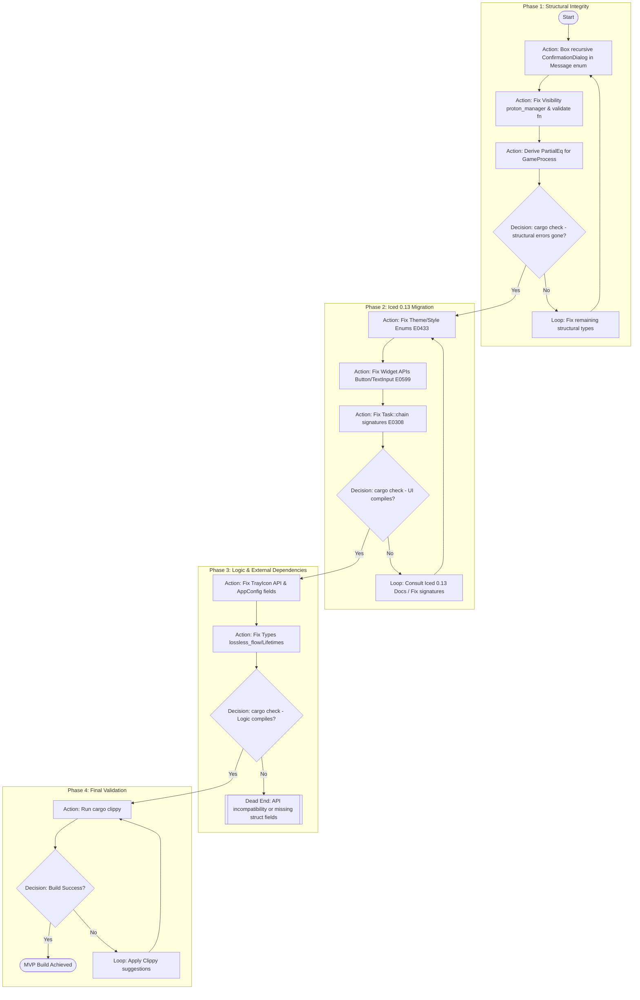

# Blueprint: Faugus Launcher Build Recovery (MVP)

This blueprint outlines the topological path to restore the compilation of the `faugus-launcher` Rust project. The project is currently in a broken state ("Horror") due to a partial migration to Iced 0.13 and structural issues like recursive types. The goal is strictly **Build Success** (MVP), not functional perfection.

[!IMPORTANT]
The "Happy Path" does not exist here. The dependency on Iced 0.13 introduces API breaking changes that must be resolved systematically. We prioritize structural integrity (types/visibility) before tackling UI framework specifics.

## Topology Diagram

## Node Catalog

| Node ID | Phase | Type | Goal | Resource Context: 📄 Files | Resource Context: 📚 Docs/Tools | Verification Criteria | On Failure |
| :--- | :--- | :--- | :--- | :--- | :--- | :--- | :--- |
| **A_STR_01** | 1 | Action | Break recursive type cycle E0072 | `src/main.rs` `src/gui/confirmation_dialog.rs` | `rustc --explain E0072` | `cargo check` no longer shows E0072/E0391 | L_STR_01 |
| **A_STR_02** | 1 | Action | Fix module/method visibility E0603, E0624 | `src/proton/mod.rs` `src/gui/add_game_dialog.rs` | Local Codebase | `cargo check` no longer shows E0603/E0624 | L_STR_01 |
| **A_STR_03** | 1 | Action | Fix missing traits E0369 | `src/launcher/game_launcher.rs` | Standard Lib | `cargo check` no longer shows E0369 | L_STR_01 |
| **A_ICE_01** | 2 | Action | Fix Style/Theme API (Container, Text) | `src/gui/add_game_dialog.rs` `src/gui/main_window.rs` | `iced::widget::container` `iced::widget::text` | `cargo check` count reduced by ~20 | L_ICE_01 |
| **A_ICE_02** | 2 | Action | Fix Widget builder APIs (TextInput, Button) | `src/gui/add_game_dialog.rs` | `iced::widget::text_input` `iced::widget::button` | No E0599 for `placeholder`/`on_input` | L_ICE_01 |
| **A_ICE_03** | 2 | Action | Fix Task/Command signatures | `src/gui/main_window.rs` | `iced::Task` | No E0308 regarding `Task<Message>` | L_ICE_01 |
| **A_LOG_01** | 3 | Action | Update TrayIcon & Config | `src/tray/tray.rs` `src/config/mod.rs` | `tray-icon` crate docs | No E0599/E0609 in tray/config | X_LOG_01 |
| **A_LOG_02** | 3 | Action | Fix primitive type mismatches & Lifetimes | `src/gui/proton_manager_dialog.rs` `src/shortcuts/desktop_entry.rs` | Rust Lifetime rules | No E0308/E0382 | X_LOG_01 |
| **A_VAL_01** | 4 | Action | Final Linting & Build | All `src/**/*.rs` | `cargo clippy` | Zero Errors, Warnings allowed (MVP) | L_VAL_01 |

## Resource Map

| File Path | Purpose | Owner Phase |
| :--- | :--- | :--- |
| `src/main.rs` | App Entry, Global Message Enum | Phase 1 & 2 |
| `src/gui/confirmation_dialog.rs` | Recursive struct definition | Phase 1 |
| `src/launcher/game_launcher.rs` | Data structures needing Traits | Phase 1 |
| `src/proton/mod.rs` | Module visibility | Phase 1 |
| `src/gui/add_game_dialog.rs` | Heavy UI logic, Widgets, Styles | Phase 2 |
| `src/gui/main_window.rs` | Main UI Layout, Task chaining | Phase 2 |
| `src/tray/tray.rs` | System Tray integration | Phase 3 |
| `src/config/mod.rs` | Configuration structs | Phase 3 |

## Exit Criteria

| Criteria | Evidence |
| :--- | :--- |
| **No Compilation Errors** | `cargo check` returns exit code 0 |
| **Recursive Types Resolved** | `Message` enum compiles without E0072 |
| **Iced 0.13 Syntax Valid** | Widgets use correct builder patterns |
| **Tray Icon Compiles** | API matches installed crate version |
