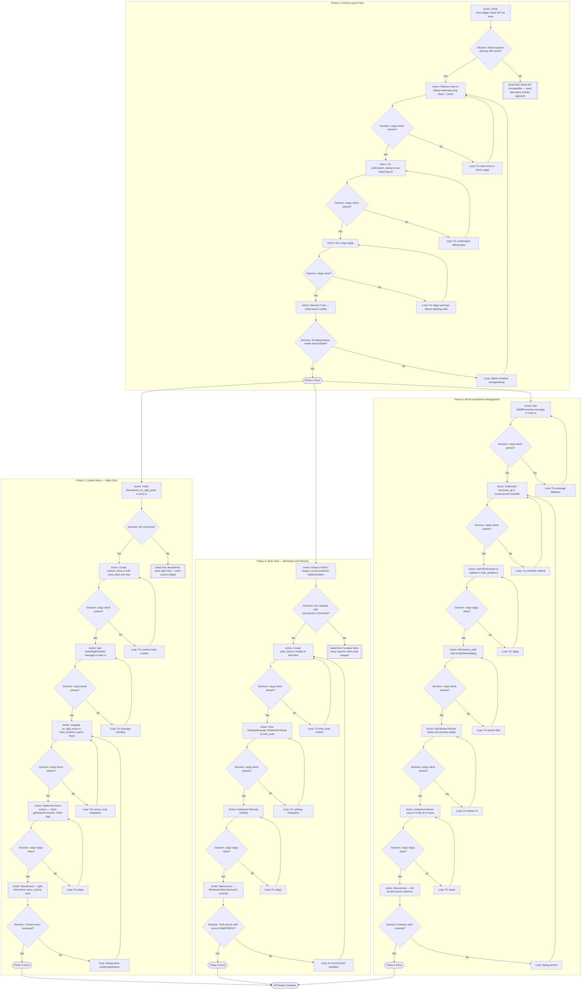

# Blueprint: GUI Bugfix — Layout & Missing Features

**Контекст**: Rust-версия Faugus Launcher имеет критические проблемы с layout модальных окон (кнопки обрезаются) и отсутствует ключевой функционал из Python-версии (контекстное меню, Winetricks, Kill All, баннеры).

**Статус бага**: Критический — приложение невозможно полноценно использовать без видимых кнопок Ok/Cancel в диалогах.

**Дата создания**: 2026-01-15

[!IMPORTANT]
Фазы строго последовательны. Phase 1 блокирует все остальные, так как без рабочих диалогов невозможно тестировать новый функционал. Phase 2-4 могут выполняться параллельно после завершения Phase 1.

[!NOTE]
Iced 0.13+ поддерживает `Stack` widget и `MouseArea::on_right_press()`. Эти API верифицированы через docs.rs. Контекстное меню потребует кастомной реализации через overlay, так как встроенного popup-menu в Iced нет.

---

## Mermaid Flowchart

---

## Node Catalog

| Node ID | Phase | Node Type | Goal | Resource Context: Files | Resource Context: Docs to Verify | Verification Tooling | Commands | Success Criteria | Failure States | On Failure | On Success |
|---------|-------|-----------|------|------------------------|--------------------------------|---------------------|----------|------------------|----------------|------------|------------|
| A1 | 1 | Action | Verify Stack widget API supports layering | N/A | `docs.rs/iced/latest/iced/widget/struct.Stack.html` | tavily_extract | N/A | Stack::push and center() confirmed | Docs unavailable or API changed | X1 | D1 |
| D1 | 1 | Decision | Stack API suitable for modal overlay? | N/A | N/A | Manual review | N/A | Stack layers elements, first defines size | API incompatible | X1 | A2 |
| A2 | 1 | Action | Refactor main.rs view() for all DialogState variants | `src/main.rs` lines 550-668 | N/A | cargo-check | `cargo check` | Dialogs use stack![main, backdrop, center(dialog)] | Type errors, lifetime issues | L1 | D2 |
| D2 | 1 | Decision | Compilation succeeds? | `src/main.rs` | N/A | cargo-check | `cargo check` | Exit code 0 | Compiler errors | L1 | A3 |
| A3 | 1 | Action | Fix confirmation_dialog.rs layout | `src/gui/confirmation_dialog.rs` lines 66-115 | N/A | cargo-check | `cargo check` | Remove row![bg, dialog], return only dialog content | Type errors | L2 | D3 |
| D3 | 1 | Decision | Compilation succeeds? | `src/gui/confirmation_dialog.rs` | N/A | cargo-check | `cargo check` | Exit code 0 | Compiler errors | L2 | A4 |
| A4 | 1 | Action | Run clippy for code quality | All modified files | N/A | cargo-clippy | `cargo clippy` | No warnings in modified code | Clippy warnings | L3 | D4 |
| D4 | 1 | Decision | Clippy clean? | N/A | N/A | cargo-clippy | `cargo clippy` | No warnings | Warnings present | L3 | A5 |
| A5 | 1 | Action | Manual UI verification | N/A | N/A | Manual | `cargo run` | All dialog buttons visible at bottom | Buttons still cut off | L4 | D5 |
| D5 | 1 | Decision | Buttons visible and functional? | N/A | N/A | Manual testing | N/A | Ok, Cancel, Apply clickable | UI still broken | L4 | T1 |
| X1 | 1 | DeadEnd | Stack API incompatible | N/A | N/A | N/A | N/A | N/A | Need alternative: custom overlay widget or Iced upgrade | N/A | N/A |
| L1-L4 | 1 | Loop | Fix issues and retry | Various | N/A | cargo-check | `cargo check` | Compilation passes | Persistent errors | Escalate | Previous Action |
| A6 | 2 | Action | Verify MouseArea::on_right_press | N/A | `docs.rs/iced/latest/iced/widget/struct.MouseArea.html` | tavily_extract | N/A | Method exists, takes Message | API missing | X2 | D6 |
| D6 | 2 | Decision | Right-click API available? | N/A | N/A | Manual review | N/A | on_right_press confirmed | Missing | X2 | A7 |
| A7 | 2 | Action | Create context_menu.rs | New: `src/gui/context_menu.rs` | N/A | cargo-check | `cargo check` | ContextMenu struct with state and view() | Compilation errors | L5 | D7 |
| D7 | 2 | Decision | Module compiles? | `src/gui/context_menu.rs`, `src/gui/mod.rs` | N/A | cargo-check | `cargo check` | Exit code 0 | Errors | L5 | A8 |
| A8 | 2 | Action | Add GameRightClicked(usize, Point) message | `src/main.rs` | N/A | cargo-check | `cargo check` | Message variant added, handled in update() | Type errors | L6 | D8 |
| A9 | 2 | Action | Add on_right_press to mouse_area in game lists | `src/gui/main_window.rs` lines 350-550 | N/A | cargo-check | `cargo check` | All view modes handle right click | Lifetime/type errors | L7 | D9 |
| A10 | 2 | Action | Implement menu actions | `src/gui/context_menu.rs`, `src/gui/main_window.rs` | N/A | cargo-check | `cargo check` | Open location uses xdg-open, logs open viewer | Missing dependencies | L8 | D10 |
| A11 | 2 | Action | Manual test context menu | N/A | N/A | Manual | `cargo run` | Right click shows menu, actions execute | Menu not visible or actions fail | L9 | D11 |
| X2 | 2 | DeadEnd | MouseArea lacks right-click | N/A | N/A | N/A | N/A | N/A | Need custom widget or different event handling | N/A | N/A |
| A12 | 3 | Action | Analyze Python winetricks implementation | `faugus_launcher.py` lines 3879-3926, `faugus_run.py` | N/A | grep, read | N/A | Understand env vars and command structure | Complex undocumented behavior | X3 | D12 |
| D12 | 3 | Decision | Replicable with std::process::Command? | N/A | N/A | Manual analysis | N/A | Clear command pattern identified | Too complex | X3 | A13 |
| A13 | 3 | Action | Create wine_tools.rs | New: `src/launcher/wine_tools.rs` | N/A | cargo-check | `cargo check` | run_winetricks(prefix, runner) function | Compilation errors | L10 | D13 |
| A14 | 3 | Action | Wire settings dialog to wine_tools | `src/gui/settings_dialog.rs`, `src/main.rs` | N/A | cargo-check | `cargo check` | WinetricksClicked triggers wine_tools | Message routing errors | L11 | D14 |
| A15 | 3 | Action | Implement Winecfg | `src/launcher/wine_tools.rs` | N/A | cargo-check | `cargo check` | run_winecfg(prefix, runner) function | Compilation errors | L12 | D15 |
| A16 | 3 | Action | Manual test wine tools | N/A | N/A | Manual | `cargo run` | Winetricks GUI and Winecfg launch | Wrong prefix or crash | L13 | D16 |
| X3 | 3 | DeadEnd | Complex Wine setup | N/A | N/A | N/A | N/A | N/A | May need to call Python script as subprocess | N/A | N/A |
| A17 | 4 | Action | Add KillAllProcesses message | `src/main.rs` | N/A | cargo-check | `cargo check` | Message variant and handler | Type errors | L14 | D17 |
| A18 | 4 | Action | Implement terminate_all | `src/launcher/mod.rs` or controller file | N/A | cargo-check | `cargo check` | Iterates all running games, kills each | Process API issues | L15 | D18 |
| A19 | 4 | Action | Add Kill All button to sidebar | `src/gui/main_window.rs` view_sidebar() | N/A | cargo-check | `cargo check` | Button visible, sends KillAllProcesses | UI layout issues | L16 | D19 |
| A20 | 4 | Action | Add banner_path to AddGameDialog | `src/gui/add_game_dialog.rs` | N/A | cargo-check | `cargo check` | Field added, serialized in get_game() | Struct mismatch | L17 | D20 |
| A21 | 4 | Action | Add banner browse button and preview | `src/gui/add_game_dialog.rs` | N/A | cargo-check | `cargo check` | Button triggers file picker, image preview shown | Image widget issues | L18 | D21 |
| A22 | 4 | Action | Copy banner to config dir on save | `src/gui/add_game_dialog.rs`, `src/icons/mod.rs` | N/A | cargo-check | `cargo check` | Banner copied to ~/.config/faugus-launcher/banners/ | IO errors | L19 | D22 |
| A23 | 4 | Action | Manual test Kill All and banners | N/A | N/A | Manual | `cargo run` | Kill All stops all games, banners display | Features broken | L20 | D23 |

---

## Resource Map

| File | Purpose | Owner Phase | Modifications Required |
|------|---------|-------------|----------------------|
| `src/main.rs` | Application entry, dialog overlay rendering | Phase 1, 2, 3, 4 | Refactor view() to use Stack; add new Messages; handle context menu state |
| `src/gui/confirmation_dialog.rs` | Delete confirmation popup | Phase 1 | Remove row-based layout, simplify to return dialog content only |
| `src/gui/main_window.rs` | Main window with game list | Phase 2, 4 | Add on_right_press to mouse_area; add Kill All button; context menu overlay |
| `src/gui/context_menu.rs` | NEW: Context menu widget | Phase 2 | Create struct ContextMenu with position, items, view() |
| `src/gui/mod.rs` | GUI module exports | Phase 2 | Export context_menu module |
| `src/gui/settings_dialog.rs` | Settings popup | Phase 3 | Replace TODO with actual wine_tools calls |
| `src/gui/add_game_dialog.rs` | Add/Edit game form | Phase 4 | Add banner_path field, browse button, preview |
| `src/launcher/wine_tools.rs` | NEW: Winetricks/Winecfg launcher | Phase 3 | Create run_winetricks(), run_winecfg() using Command |
| `src/launcher/mod.rs` | Launcher module | Phase 3, 4 | Export wine_tools; add terminate_all to controller |
| `faugus_launcher.py` | Python reference (READ ONLY) | Phase 3 | Reference for winetricks command structure |
| `faugus_run.py` | Python reference (READ ONLY) | Phase 3 | Reference for environment variable setup |

---

## Invariants / Safety Bounds

| Invariant | Enforcement | Test/Check |
|-----------|-------------|------------|
| Dialog buttons must always be visible within window bounds | Use center() wrapper with max_height constraint | Manual UI test on 1200x800 window |
| Stack widget base layer defines overall size | First element in stack![] must be main_window.view() | Code review of main.rs view() |
| Context menu must close when clicking outside | MouseArea backdrop with on_press(CloseContextMenu) | Manual test: click outside closes menu |
| Winetricks must receive correct WINEPREFIX | Validate prefix path exists before spawning | Unit test or manual verification |
| Kill All must not kill non-game processes | Only iterate games tracked in launch_controller.running | Code review of terminate_all implementation |
| Banner images must be copied, not moved | Use std::fs::copy, not rename | Code review |
| No deletion of future-phase code stubs | Use #[allow(dead_code)] instead of removing | Clippy pass without deletions |
| Game config backward compatibility | New fields must have Default | Serde skip_serializing_if or default |

---

## Exit Criteria

| Criteria | Evidence Node IDs |
|----------|------------------|
| All dialogs (Add Game, Settings, Log Viewer, Proton Manager, Confirmation) show Ok/Cancel buttons | A5, D5, T1 |
| Confirmation dialog centered, not pushed to right | A3, D3 |
| Right-click on game shows context menu with 8 items | A11, D11, T2 |
| Context menu actions work: Open game location, Open prefix, Show logs | A10, A11 |
| Winetricks button in Settings launches winetricks GUI | A16, D16, T3 |
| Winecfg button in Settings launches winecfg | A15, A16 |
| Kill All button terminates all running games | A23, D23, T4 |
| Banner can be selected when adding/editing game | A21, A23 |
| Banner displays in Blocks and Banners view modes | A23, D23 |
| cargo clippy passes without warnings on modified files | A4, A10, A15, A22 |
| cargo check passes for entire project | D2, D3, D7, D8, D9, D13, D14, D17, D18, D19, D20, D21 |

---

## Handover Note (Phase 1 Complete)

### What was done:
- **Stack Implementation**: Refactored `src/main.rs` to use `iced::widget::Stack`. The main window content is now always rendered as the base layer, with dialogs rendered as an overlay.
- **Modal Centering**: Dialogs are now wrapped in a `container` that fills the screen, centers the dialog content (`center_x`, `center_y`), and provides a semi-transparent black backdrop (80% opacity).
- **Confirmation Dialog Fix**: Removed the broken `row![background, dialog]` layout in `src/gui/confirmation_dialog.rs`. It now returns only the dialog box content, which is correctly positioned by the `Stack` in `main.rs`.
- **Enum Optimization**: Boxed large variants in `DialogState` (`AddGame`, `Settings`, `LogViewer`, `ProtonManager`) to reduce memory footprint and satisfy Clippy.
- **Quality Control**: `cargo check` and `cargo clippy` pass (excluding unrelated pre-existing warnings).

### Technical Debt:
- **Redundant Padding**: Some dialogs (like `AddGameDialog`) have their own internal padding which, when combined with the padding in `main.rs`, results in larger margins. This is acceptable for MVP but could be unified later.
- **Backdrop Color**: Hardcoded to `rgba(0, 0, 0, 0.8)`. Could be moved to a theme-based constant.

### Status:
Phase 1 is **COMPLETE**. The layout bug is fixed, and dialog buttons should now be visible and functional. Phase 2 (Context Menu), Phase 3 (Wine Tools), and Phase 4 (Kill All/Banners) are now **UNBLOCKED**.
